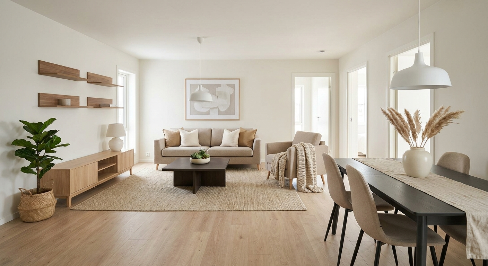
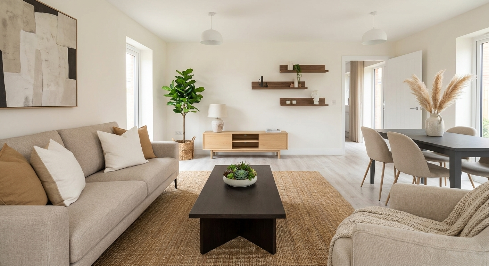
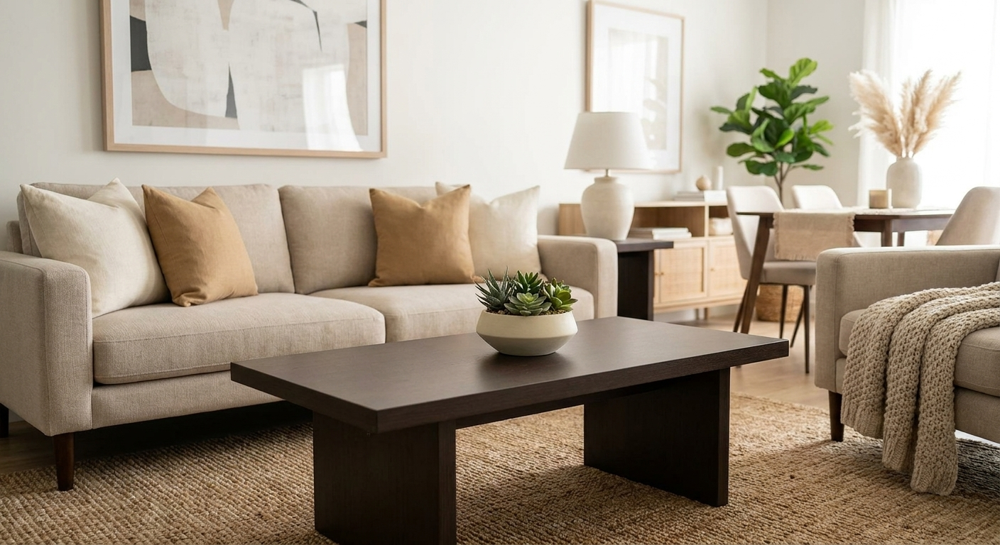
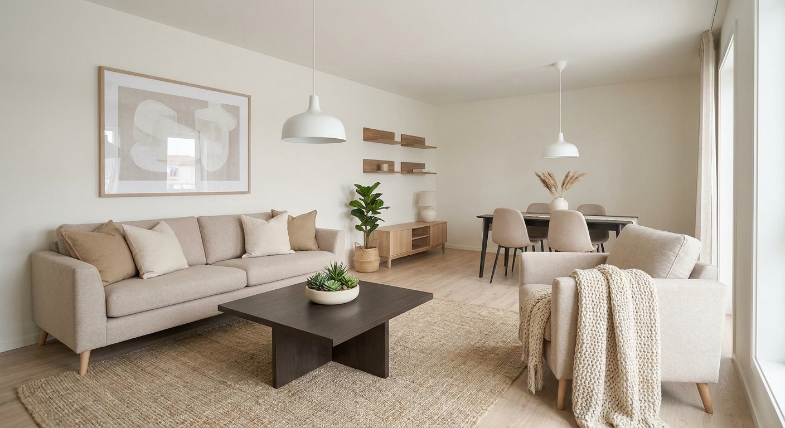

# Example run

One unedited `POST /api/generate`, committed so the output is visible without
running the code or holding API keys.

**Input:** [`samples/plan_1.png`](../../samples/plan_1.png), the 25.2 m² open-plan
living/kitchen.
**Settings:** Scandinavian, warm neutral palette, 4 viewpoints, 1 variation,
Nano Banana Pro (`gemini-3-pro-image`).
**Time:** 81 seconds end to end, including the analyzer and planner calls.

| | |
|---|---|
|  |  |
| Wide establishing view (the reference every other view is generated from) | Opposite corner |
|  |  |
| Seating detail | From the window side |

## Products used

| Product | Supplier | Qty | Total (GEL) |
|---|---|---:|---:|
| [Moon sofa](https://comforter.ge/en/product/upholstered-furniture/moon/4245) | Comforter | 1 | 6,844 |
| [Porto armchair](https://comforter.ge/en/product/upholstered-furniture/porto/4195) | Comforter | 1 | 3,052 |
| [Marsis coffee table](https://comforter.ge/en/product/living-room-furniture/marsis/4711) | Comforter | 1 | 1,205 |
| [Silva wall unit](https://comforter.ge/en/product/living-room-furniture/silva/3731) | Comforter | 1 | 6,652 |
| [Bacardi dining table](https://comforter.ge/en/product/table-chair/bacardi/4919) | Comforter | 1 | 3,235 |
| [K531 dining chair](https://comforter.ge/en/product/table-chair/k531/4929) | Comforter | 4 | 1,688 |
| [Pendant light 528090 Tek-is](https://gorgia.ge/ka/ganateba/shida-ganateba/cheris-sanati-chagi-sakidi/chagi-didi-tetri-528090-tek-is/) | Gorgia | 2 | 42 |
| [Shelf RAF-033-OO-1](https://gorgia.ge/ka/aveji/karadebi-da-taroebi/taro/თარო-raf-033-oo-1-oak-walnut/) | Gorgia | 3 | 170 |
| [Laminate AURA SENSE SAFIR](https://gorgia.ge/ka/remonti/iataki/laminirebuli-iataki/ლამინირებული-იატაკი-191x1200x10მმ-aura-sense-safir-32-კლასი/) | Gorgia | 1 | 33.23 |
| [Interior emulsion paint 7.5L](https://gorgia.ge/ka/remonti/laq-sagebavebi/sagebavi/kedlis-da-cheris-sagebavi/interieris-wyalemulsia-plus-7.5lt-tetri/) | Gorgia | 1 | 103.00 |
| **Estimated total** | | | **23,023.33** |

Every link resolves to a live supplier product page. Nine further items (rug,
cushions, throw, plants, artwork, table runner, vase) appear in the renders as
**styling only**: neither supplier stocks them, so they are described precisely
enough to stay fixed across viewpoints but are excluded from the product list and
the total.

## What is in this folder

| File | What it shows |
|---|---|
| `scene-spec.json` | the planner's output: every placement with its catalog id, quantity and position |
| `compiled-prompt.txt` | the scene description compiled from that spec, byte-identical across all four renders |
| `api-response.json` | the raw `/api/generate` response |
| `*.png` | the four renders |

Reading `compiled-prompt.txt` next to `scene-spec.json` is the quickest way to
see how consistency is enforced: one deterministic function turns the spec into
text, and every viewpoint call reuses that exact text plus the canonical image.

## Honest reading of these four images

Holding across all four: the sofa, its cushions, the dark coffee table, the oak
sideboard, the fiddle-leaf fig, the dining table with pampas grass, the armchair
and its throw, the jute rug, the pendant lights and the floor.

Not holding: the artwork above the sofa is a soft beige abstract in the
establishing view and a bolder black and white piece in the opposite-corner view,
and the floating shelves sit on a different wall between the two. This is the
residual drift described in finding 5 of the main [README](../../README.md):
reduced by ranking the reference image above the text and by listing exact
quantities, but not eliminated.
